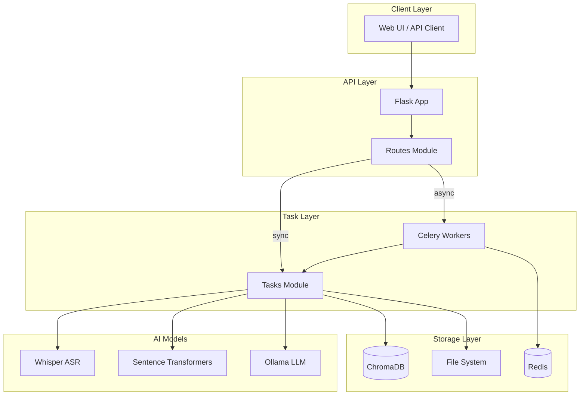
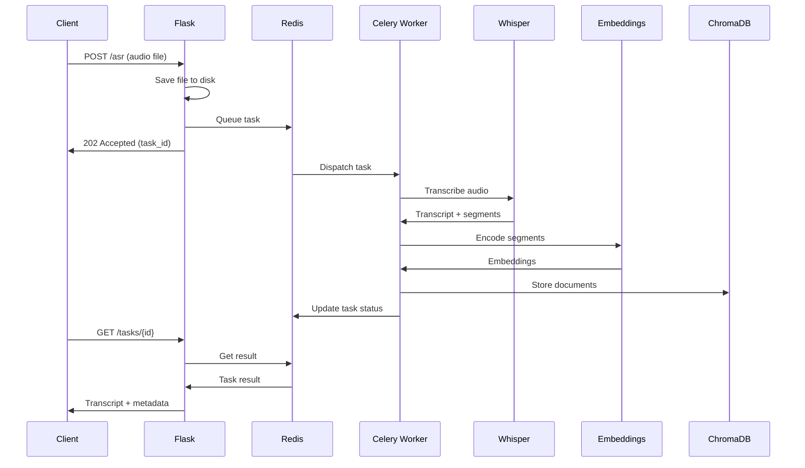
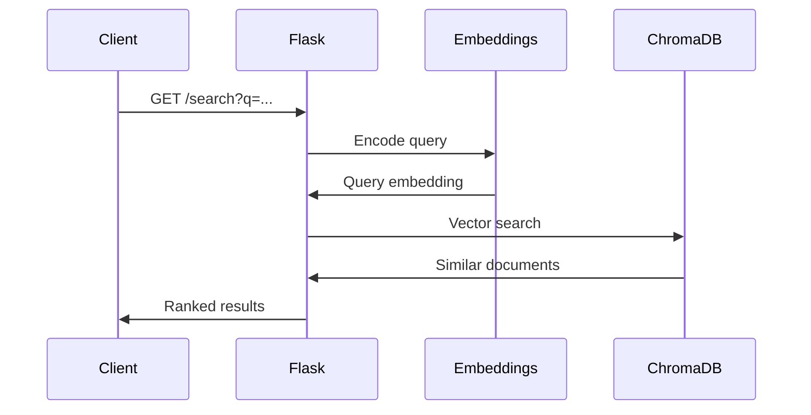

# Architecture Documentation

## Audio Transcription & Semantic Search System

---

## System Overview

This system provides:
1. **Audio Transcription** - Convert audio recordings to text using OpenAI Whisper
2. **Semantic Search** - Search transcripts by meaning using vector embeddings
3. **AI Analysis** - Extract insights, action items, and entities from transcripts

---

## Architecture Diagram



---

## Component Details

### 1. Flask Application (`app/__init__.py`)

- Creates Flask app with configuration
- Initializes Celery with Redis broker
- Registers blueprints

```python
celery = Celery(__name__, 
                broker=Config.broker_url,
                backend=Config.result_backend,
                include=['app.tasks'])
```

### 2. API Routes (`app/routes.py`)

| Endpoint | Method | Purpose |
|----------|--------|---------|
| `/` | GET | Main UI |
| `/health` | GET | System health check |
| `/asr` | POST | Submit audio for transcription |
| `/search` | GET | Semantic search |
| `/analyze/<task_id>` | POST | Start AI analysis |
| `/tasks/<task_id>` | GET | Get task status |
| `/stats` | GET | System statistics |

### 3. Background Tasks (`app/tasks.py`)

#### Task: `transcribe_and_embed_task`
- **Trigger:** `/asr` endpoint
- **Steps:**
  1. Load Whisper model (lazy, cached)
  2. Transcribe audio file
  3. Generate embeddings for each segment
  4. Store in ChromaDB
  5. Clean up audio file

#### Function: `search_audio_sync`
- **Note:** This is a synchronous function, NOT a Celery task
- Encodes query text
- Searches ChromaDB with cosine similarity
- Returns ranked results

#### Task: `analyze_transcript_task`
- **Trigger:** `/analyze/<task_id>` endpoint
- **Steps:**
  1. Try Ollama LLM for analysis
  2. Fall back to pattern matching if unavailable
  3. Extract summary, action items, entities

### 4. Model Manager (`app/tasks.py`)

Handles lazy loading and thread-safe access to ML models:

```python
class ModelManager:
    # Thread-safe singletons
    _whisper_model = None
    _embedding_model = None
    
    # Per-worker ChromaDB clients (critical for concurrency!)
    _chroma_clients: Dict[int, chromadb.PersistentClient] = {}
    _collections: Dict[int, Any] = {}
```

**Why per-worker ChromaDB?**
- ChromaDB `PersistentClient` is NOT thread-safe across processes
- Each Celery worker is a separate process
- Sharing clients caused race conditions and data corruption

---

## Data Flow

### Transcription Flow



### Search Flow



---

## Concurrency Model

### Worker Configuration

```bash
celery -A app.celery worker --loglevel=info --concurrency=4
```

- **4 worker processes** (configurable)
- Each worker has isolated:
  - ChromaDB client
  - Python interpreter
  - Model instances (shared within process via lazay loading)

### Thread Safety Mechanisms

1. **Threading Locks** - For model loading
```python
_whisper_lock = threading.Lock()
_embedding_lock = threading.Lock()
_chroma_lock = threading.Lock()
```

2. **Per-Worker Isolation** - For database clients
```python
worker_id = threading.current_thread().ident or os.getpid()
if worker_id not in cls._chroma_clients:
    cls._chroma_clients[worker_id] = chromadb.PersistentClient(...)
```

3. **Unique IDs** - For preventing collisions
```python
def generate_unique_chunk_id(task_id, segment_id, text, timestamp):
    content_to_hash = f"{task_id}_{segment_id}_{text}_{timestamp}"
    hash_suffix = hashlib.md5(content_to_hash.encode()).hexdigest()[:8]
    return f"{task_id}_{segment_id}_{hash_suffix}"
```

---

## Error Handling Strategy

### Layered Approach

```
┌─────────────────────────────────────────┐
│  Layer 1: Input Validation              │
│  - Check file exists                    │
│  - Validate parameters                  │
├─────────────────────────────────────────┤
│  Layer 2: Graceful Degradation          │
│  - Fallback models (turbo → base)       │
│  - Pattern matching if Ollama fails     │
├─────────────────────────────────────────┤
│  Layer 3: Error Isolation               │
│  - Individual document encoding         │
│  - Per-worker DB clients                │
├─────────────────────────────────────────┤
│  Layer 4: State Management              │
│  - Always update task state             │
│  - Structured logging                   │
└─────────────────────────────────────────┘
```

### Task Retry Policy

```python
@celery.task(bind=True, max_retries=3, default_retry_delay=60)
def transcribe_and_embed_task(self, audio_path, translate_to_english=False):
    ...
```

- Max 3 retries
- 60 second delay between retries
- Unique IDs prevent duplication on retry

---

## Configuration (`app/config.py`)

| Setting | Source | Default |
|---------|--------|---------|
| `broker_url` | `CELERY_BROKER_URL` | `redis://localhost:6379/0` |
| `result_backend` | `CELERY_RESULT_BACKEND` | `redis://localhost:6379/0` |
| `UPLOAD_FOLDER` | Computed | `./uploads` |
| `CHROMA_DB_PATH` | `CHROMA_DB_PATH` | `./chroma_db` |
| `OLLAMA_API_BASE_URL` | `OLLAMA_API_BASE_URL` | `http://localhost:11434` |
| `OLLAMA_MODEL` | `OLLAMA_MODEL` | `llama3` |

---

## Monitoring & Health

### Health Check Endpoint

```bash
GET /health
```

Response:
```json
{
  "status": "healthy",
  "whisper": {"loaded": true, "healthy": true},
  "embedding": {"loaded": true, "healthy": true},
  "chromadb": {"connected": true, "count": 1234},
  "redis": {"connected": true}
}
```

### Key Metrics to Monitor

1. **Task Queue Depth** - Redis queue size
2. **Task Duration** - Transcription time
3. **Error Rate** - Failed tasks percentage
4. **ChromaDB Size** - Document count
5. **Worker Memory** - Per-worker RAM usage

---

## Known Limitations

1. **Single Server** - Not horizontally scalable without shared storage
2. **Model Memory** - Whisper + Embeddings require ~4GB RAM
3. **No Authentication** - Add before production use
4. **No Rate Limiting** - Vulnerable to abuse

---

## Future Improvements

1. **Horizontal Scaling** - Kubernetes deployment
2. **Model Serving** - Separate model server (Triton, TorchServe)
3. **Search Optimization** - HNSW index tuning
4. **Multi-tenant** - Per-doctor data isolation
5. **Streaming** - Real-time transcription
